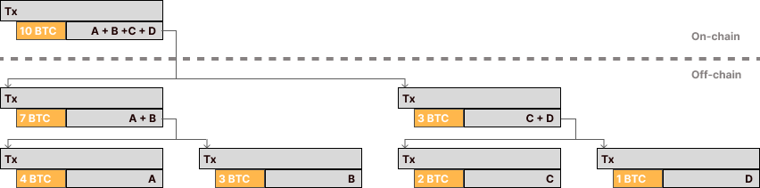
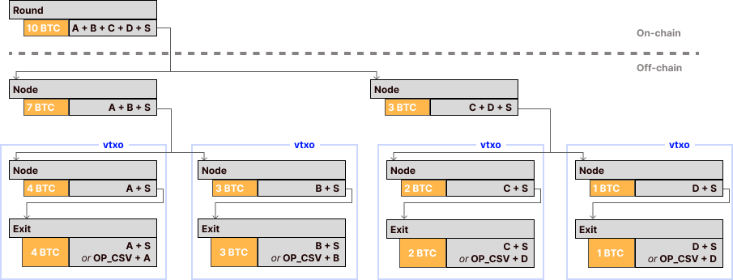
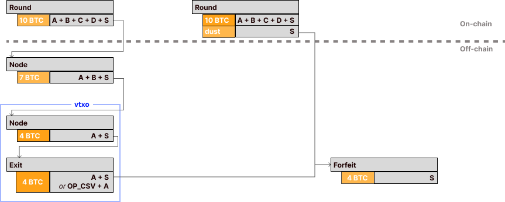
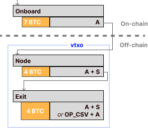
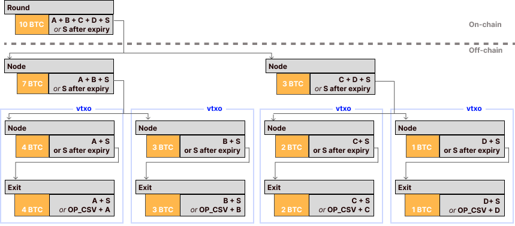

# The Ark protocol

The Ark protocol is a second layer on the bitcoin network. It
offers cheap on-boarding, low and predictable fees and fast transaction confirmation.
The protocol works on bitcoin today and doesn't require any new op-codes or changes in consensus
rules.

The protocol centers around an Ark Service Provider (ASP) that initiates and coordinates rounds. In
each round a new bitcoin transaction is made that will be confirmed on-chain. However, all money
received in a single round, will be confirmed in a single shared UTXO. The Ark protocol prescribes
how users share UTXOs while at all times having access to their funds. A share in such a round is
called a VTXO.

A client that owns a VTXO can perform a unilateral exit. This uniltateral exit is completely
permissionless and can only be triggered by the client. At any point in time the client is in full
control of their funds. To claim a VTXO a client pays on-chain fees and broadcasts their VTXO.

A client can also off-board by performing a cooperative exit which is co-signed by the ASP and has a
much smaller on-chain footprint. Inside the Ark, they can make payments by swapping their VTXOs for
new VTXOs, for example one for a recipient and another one containing the change. In this way, Ark
transactions are very similar in topology to bitcoin transaction. The fee-savings are significant
because swapping VTXOs has no on-chain footprint.

Ark is an optimistic protocol. We expect unilateral exits to be used by exception, as such only the
round-transaction should make it on-chain. The protocol requires that VTXOs have an expiry time.
This allows the ASP to claim all funds in an expired round using a single on-chain transaction.

In general, the expiry time doesn't harm clients. Clients can refresh an old VTXO which is close
to the expiry-time by swapping it against a new VTXO.

## UTXO-sharing using transaction trees

In this chapter we'll explain how UTXO-sharing is achieved in the Ark protocol.
To keep thing simple we start with an ASP that wants to perform mass pay-out 
to a group of clients. A similar set-up will happen every round.

One approach is that the ASP could create single transaction which has one taproot-output for each
client.  This means that each output adds `43 vbytes` to the transaction size or a cost of `430 sat`
assuming `10 sat/vbyte`.

Instead of paying each user separately, the ASP builds a tree transactions that pays each user in a
transaction in one of the tree leaves.  This tree can be constructed in such a way that any payment
is final even if only the root of the tree is confirmed on-chain. The ASP only has to pay the fee
for a a single transaction with a single taproot output.

In this case, the ASP is saving fees at the expense of their clients. A client
that wants to spend the bitcoin has to pay onchain fees for each transaction in
their branch of the tree. I'll promise we'll solve that problem in the next
section. Let's ignore that problem for now and look into how the tree is
constructed.

The core idea is that all funds are secured by a N-of-N multisig that must be
signed by all receivers.  Having N-of-N is great, if you are one of the
receivers you have an absolute veto power.

The N-of-N multisig is signed before the ASP sends any funds to the tree.  Each
client has a fully signed transasction and can claim the funds at any time by
broadcasting their transactions and paying onchain fees. We call this a
unilateral exit because their is no need to ask permission from anyone.

We apply this idea recursively. At the root of the tree is a transaction which
has an output that is signed by all receivers. We have a presigned transaction
that splits the funds over two outputs. Each output is locked by a multisig of
all receivers for that output. We repeat this until we reach a leaf where the
output is owned by a single receiver. We call the outputs at the leaf a VTXO or
a virtual transaction output.

To construct such a tree the ASP can construct the transaction, request
signatures from all clients. Once all transactions are signed the ASP can
safely fund the transaction and publish the root of the tree.

This transaction tree is a core building block of Ark. It provides each user
with a mechanism to withdraw their funds unilaterally. This is what makes
Ark self-custodial. 

Generally, we want to reserve the unilateral exit only for rare occasions.
In the next section we'll explain how clients can avoid paying on-chain fees
by swapping their VTXOs.

## Swap VTXOs atomically

Swapping a VTXO doesn't have an onchain footprint and is much cheaper than a
unilateral exit. The ASP provides the swaps in exchange for a small fee.

You can use a swap to make a payment. To make a payment you can swap one or more
VTXOs that are owned by you against one VTXO that is owned by the recipient and
a second VTXO containing the change, similar to a regular bitcoin transaction.

The same mechanism can be used to exit the ark. In this case we swap a VTXO
against a normal UTXO.

The basic building blocks of an atomic swap are forfeits and connectors. The
forfeit-construct allows a client to give up ownership of their VTXO(s). The
connector makes the forfeit conditional and ensures the client will only give up
their VTXO if something is offered in return, namely the creation of new VTXOs
or a UTXO.

### Forfeit transactions

If you are already familiar with the lightning network you might know how these forfeits
work. We use the same mechanism as penalty transaction in the lightning
network.

To support forfeits each VTXO must follow a specific pattern that consists out
of 2 transactions.  The first is a taproot transaction wich is locked by a
2-of-2 multisig between the client and the ASP.  This output pays into a
pre-signed transaction called the exit transaction; this transaction is
pre-signed in the round the VTXO was created in. The client can only spend the
exit transaction after {{ ark.vtxo_exit_delta }} blocks which is roughly {{
ark.vtxo_exit_delta_description }}. The time lock is relative, this means we
only start counting the blocks once the exit transaction is confirmed on chain.
We implement this behavior using relative locktimes and the
`OP_CHECKSEQUENCEVERIFY` (`CSV`) opcode in bitcoin script.

At any time, the client can perform a unilateral exit. The only difference is that the client has
to wait roughly {{ ark.vtxo_exit_delta_description }} before the funds can be used.

The client can sign a forfeit transaction and send it to the ASP. This is a transaction that takes
all the funds in the VTXO and sends it to the ASP. A client that attempts to perform a unilateral
exit on a forfeited VTXO would just waste fees. The exit path for the client is time-locked and the
ASP can claim the funds by broadcasting the forfeit transaction immediately. 

### Connectors make swap atomic

A connector ensures that if a client forfeits a VTXO they get something in return.
This could either be a UTXO or VTXO in a next round.

The connector ensures that a forfeit transaction is only valid if the next round exists.  The
connector is just an output that goes from the round transaction into the forfeit transaction.

It is fully safe for the client to sign a forfeit transaction with a connector. The forfeit
transaction is only valid if the round makes it on-chain.

### Stages of a round

The round has the following phases

1. ASP announces the start of the round.
2. All clients tell what VTXOs they want to swap.
3. The ASP constructs the transaction tree and forfeit transactions.
4. The clients sign the transaction tree and all forfeit transactions.
5. The ASP funds the round and ensures it is confirmed on-chain.

## Boarding the Ark

A client that owns a bitcoin UTXO can onboard funds into the Ark at any time.
There is no need to wait for a round to occur.

The idea is pretty simple. At any point in time the client can ask the server
to cosign a VTXO. Once the VTXO is created the client can fund it.

This process will result in a single on-chain transaction. Typically, the server
will require 6 confirmations before it will allow the VTXO to participate in a round.
This protetects the server from double-spends.

## Expiry dates allow the ASP to reclaim funds

As time passes, more and more VTXOs will have been swapped an the 
number of VTXOs in the transaction tree owned by the ASP will grow.
The ASP could broadcast the entire tree and claim the VTXOs. In this
case the ASP would have to pay on-chain fees for every transaction in the tree.
This is not feasible from an economics point of view.

The trick is to add an expiry time to a round. Each round, or better all VTXOs created in this
round, expires after a fixed interval.  By default this interval is {{ ark.vtxo_expiry_delta }}
blocks which is roughly {{ ark.vtxo_expiry_delta_description }}.

If no client performed a unilateral exit, the ASP can just claim all funds in the 
round transaction once the round has expired. 

